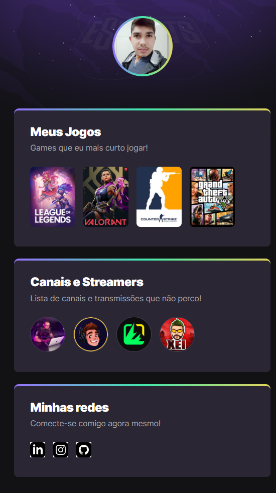

# NLW eSports - Trilha Explorer

> Trilha Explorer

Projeto construído no evento Next Level Week da Rocketseat.

[🔗 Clique e acesse a página](https://claudiolira.github.io/nlw-esports-explorer/)

## 🛠 Tecnologias

- HTML
- CSS
- GIT
- GITHUB

## O que aprendi nesse evento

- Apesar de ser iniciante, sinto muito orgulho de mim mesmo.
- Estudar é uma parte de nós que nunca deveria ser esquecida.
- Ter fé e foco em um objetivo é acreditar numa conquista.
- Manter minha mente sempre aberta para o novo, faz parte do percurso.

## 🙂 Contato

- https://www.linkedin.com/in/liraclaudio/
